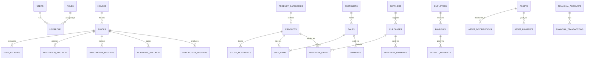

# Complete ERD

```mermaid
erDiagram
    USERS ||--o{ USERROLE : has
    ROLES ||--o{ USERROLE : assigned_to
    HOUSES ||--o{ FLOCKS : houses
    FLOCKS ||--o{ FEED_RECORDS : consumes
    FLOCKS ||--o{ MEDICATION_RECORDS : receives
    FLOCKS ||--o{ VACCINATION_RECORDS : receives
    FLOCKS ||--o{ MORTALITY_RECORDS : tracks
    FLOCKS ||--o{ PRODUCTION_RECORDS : produces
    PRODUCT_CATEGORIES ||--o{ PRODUCTS : contains
    PRODUCTS ||--o{ STOCK_MOVEMENTS : tracks
    CUSTOMERS ||--o{ SALES : makes
    SALES ||--|{ SALE_ITEMS : includes
    PRODUCTS ||--o{ SALE_ITEMS : sold_as
    SALES ||--o{ PAYMENTS : paid_via
    SUPPLIERS ||--o{ PURCHASES : supplies
    PURCHASES ||--|{ PURCHASE_ITEMS : includes
    PRODUCTS ||--o{ PURCHASE_ITEMS : bought_as
    PURCHASES ||--o{ PURCHASE_PAYMENTS : paid_via
    EMPLOYEES ||--o{ PAYROLLS : receives
    PAYROLLS ||--o{ PAYROLL_PAYMENTS : paid_via
    ASSETS ||--o{ ASSET_DISTRIBUTIONS : distributed_to
    ASSETS ||--o{ ASSET_PAYMENTS : paid_via
    FINANCIAL_ACCOUNTS ||--o{ FINANCIAL_TRANSACTIONS : logs
```
